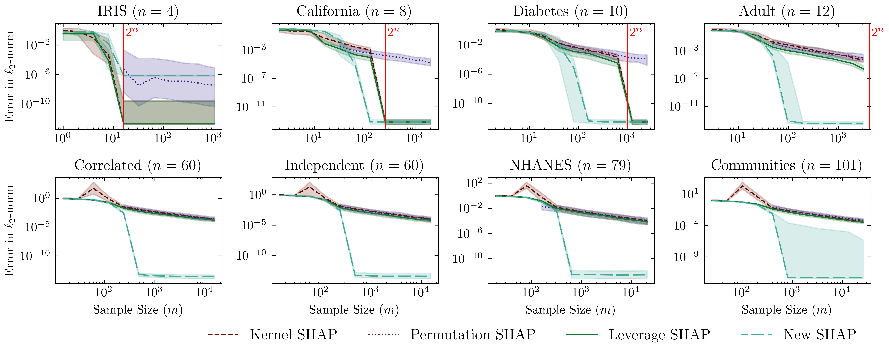

## Leverage SHAP

Leverage SHAP is a regression-based estimator for approximating Shapley values, proposed in ["Provably Accurate Shapley Value Estimation via Leverage Score Sampling"](https://arxiv.org/abs/2410.01917) by [Christopher Musco](https://www.chrismusco.com) and [R. Teal Witter](https://www.rtealwitter.com).

### Algorithm Overview

Like Kernel SHAP, Leverage SHAP approximates Shapley values by solving a weighted linear regression problem over a small number of model evaluations. However, Leverage SHAP differs from Kernel SHAP in three key ways:

1. Leverage SHAP uses **leverage score sampling** to select which model evaluations to include in the regression, while Kernel SHAP samples each coalition with respect to its weight in the regression problem.

2. Leverage SHAP uses a **projected regression** solution to compute Shapley value estimates, while Kernel SHAP uses a standard weighted least squares solution where the "infinite weight" on the empty and full coalitions is approximated by assigning them a very large finite weight.

3. Leverage SHAP directly **samples coalitions without replacement**, while Kernel SHAP uses rejection sampling  and up-weights the coalitions that happen to be selected multiple times.



### Small Example

```python
import shap
import xgboost as xgb
import leverageshap as ls

X, y = ls.load_dataset('California')
n = X.shape[1]
model = xgb.XGBRegressor().fit(X, y)
baseline, explicand = ls.load_input(X)

# Since the model is a tree model, we can compute true SHAP values using Tree SHAP
true_shap_values = shap.TreeExplainer(model).shap_values(explicand, baseline)

estimated_shap_values = ls.estimators['Leverage SHAP'](baseline, explicand, model, sample_size=10*n)

print("True SHAP values: ", true_shap_values)
print("Estimated SHAP values from Leverage SHAP: ", estimated_shap_values)
```

### Benchmarking

This codebase only implements Leverage SHAP, and relies on the [SHAP](https://github.com/slundberg/shap) library for Tree SHAP, Kernel SHAP, and Permutation SHAP implementations.

In order to benchmark Leverage SHAP against other estimators, we recommend using the [shapiq](https://github.com/mmschlk/shapiq) library.

Important Note: The implementation of Kernel SHAP in shapiq uses elements of the Leverage SHAP approach (the projected regression solution and the sampling method), so the benchmarking results may not reflect the performance of the official Kernel SHAP algorithm in [SHAP](https://github.com/slundberg/shap).

### Credit

Please cite our work with the following `bibtex` entry:
```bibtex
@inproceedings{musco2025provably,
  title={Provably Accurate Shapley Value Estimation via Leverage Score Sampling},
  author={Musco, Christopher and Witter, R Teal},
  booktitle={International Conference on Learning Representations},
  year={2025}
}
```
