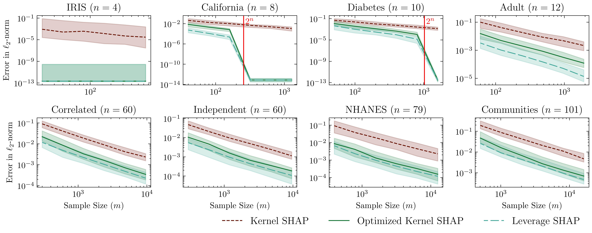

## Leverage SHAP

Leverage SHAP is a regression-based estimator for approximating Shapley values, proposed in ["Provably Accurate Shapley Value Estimation via Leverage Score Sampling"](https://arxiv.org/abs/2410.01917) by [Christopher Musco](https://www.chrismusco.com) and [R. Teal Witter](https://www.rtealwitter.com).

### Algorithm Overview

Like Kernel SHAP, Leverage SHAP approximates Shapley values by solving a weighted linear regression problem over a small number of model evaluations. However, Leverage SHAP differs from Kernel SHAP in three key ways:

1. Leverage SHAP uses **leverage score sampling** to select which model evaluations to include in the regression, while Kernel SHAP samples each coalition with respect to its weight in the regression problem.

2. Leverage SHAP uses a **projected regression** solution to compute Shapley value estimates: the efficiency constraint is removed exactly by projecting off the all-ones direction, leaving an unconstrained least squares problem. The official Kernel SHAP implementation instead eliminates one variable using the constraint and solves the resulting weighted least squares problem.

3. Leverage SHAP directly **samples coalitions without replacement** using a Bernoulli sampler. The official Kernel SHAP implementation (what the paper calls *Optimized Kernel SHAP*) enumerates every coalition of the smallest and largest sizes when the budget allows, and falls back to sampling with replacement for the remaining sizes, up-weighting coalitions that are drawn multiple times.



### Small Example

```python
import shap
import xgboost as xgb
import leverageshap as ls

X, y = ls.load_dataset('California')
n = X.shape[1]
model = xgb.XGBRegressor().fit(X, y)
baseline, explicand = ls.load_input(X)

# Since the model is a tree model, we can compute true SHAP values using Tree SHAP
true_shap_values = shap.TreeExplainer(model).shap_values(explicand, baseline)

estimated_shap_values = ls.estimators['Leverage SHAP'](baseline, explicand, model, sample_size=10*n)

print("True SHAP values: ", true_shap_values)
print("Estimated SHAP values from Leverage SHAP: ", estimated_shap_values)
```

### Benchmarking

This codebase implements Leverage SHAP and a benchmarking harness (`leverageshap/benchmark.py`, driven by `run.py --benchmark`) that compares it against the Kernel SHAP and Permutation SHAP implementations in the [SHAP](https://github.com/slundberg/shap) library, with Tree SHAP as ground truth. The estimator labeled "Kernel SHAP" in the output is `shap.KernelExplainer` with paired sampling and exhaustive enumeration of small coalition sizes, i.e. *Optimized Kernel SHAP* in the paper's terminology. Permutation SHAP is given the same budget of `m` model evaluations through `max_evals`; budgets below `2n+1` are raised to `2n+1` with a printed warning.

Leverage SHAP is also available in the [shapiq](https://github.com/mmschlk/shapiq) library. Note that shapiq's Kernel SHAP shares the projected regression solution and sampler with Leverage SHAP, so results from shapiq do not reflect the official Kernel SHAP algorithm.

### Credit

Please cite our work with the following `bibtex` entry:
```bibtex
@inproceedings{musco2025provably,
  title={Provably Accurate Shapley Value Estimation via Leverage Score Sampling},
  author={Musco, Christopher and Witter, R Teal},
  booktitle={International Conference on Learning Representations},
  year={2025}
}
```
